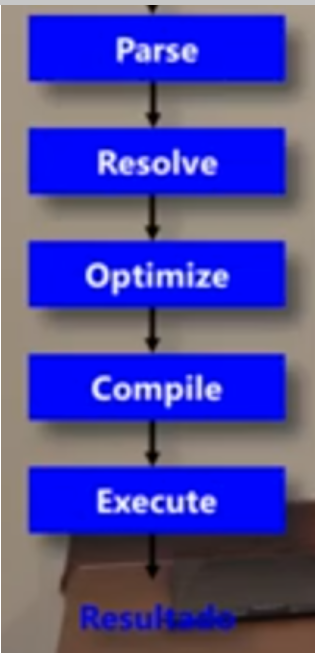

# SQL Server Expert - Query Tuning

## Otimizador de Consultas

[Link para vídeo Otimizador de Consultas 1a Parte](https://youtu.be/kE_2WSTTqoQ?si=QbHVlhyHMCCvurmM)

### Fases de Execução de uma Query

Quando enviamos uma instrução para um servidor SQL Server, ele passa internamente por cinco fases de execução, como mostrado na figura abaixo:

Vamos entender cada uma delas:

- 1a fase = **Parse**: Verifica a sintaxe, ou seja, se a instrução foi escrita corretamente.
- 2a fase = **Resolve**: Verifica a existência dos objetos, se não estou fazendo referências a tabelas ou colunas inexistentes, nesta fase também realiza algumas alterações na instrução que escrevemos, uma vez que internamente ele entende de forma diferente, como por exemplo um `like` vira uma função, um `between` vira uma expressão com `AND`.
- 3a fase = **Optimize**: Esta é a fase principal, nela o SQL Server tem um componente chamado "Otimizador de Consultas", que analisa a query, o tamanho das tabelas, os índices que existem em cada tabela e elabora um Plano de Execução que são todos os passos internos necessários para o SQL Server executar fisicamente a consulta, de modo mais eficiente possível.
- 4a fase = **Compile**: Uma vez elaborado o Plano de Execução, ele é compilado.
- 5a fase = **Execute**: Depois de compilado o Plano de Execução é executado e retorna os dados para o usuário.

### Tipos de Otimizadores de Consultas

Temos basicamente dois tipos de Otimizadores de Consultas, sendo eles:

- **Rule Based Otimizer (RBO)**: Primórdios do SQL Server, otimizador baseado em regras, usado em uma época que não havia grande poder computacional, basicamente olhava a escrita da query e a partir daí elaborava um Plano de Execução, por exemplo se uma query utilizava uma clausula `WHERE` filtrando por uma coluna que existe no índice, ele o utilizaria para resolver a query, o que nem sempre era a melhor solução.

- **Cost Based Optimizer (CBO)**: Com a evolução do poder computacional, criou-se um otimizador com base em custo, que é bem mais elaborado, complexo, consumindo vários ciclos de CPU, entretanto, entrega Planos de Execução muito melhores, as execuções das consultas ocorrem de modo mais eficiente. Para isso faz uso intensivo das Estatísticas de Banco de Dados, que dada sua importância, precisa estar sempre atualizada.

Podemos encontrar Planos de Execução diferentes, dependendo da Edição do SQL Server que estivermos utilizando, desta forma é altamente recomendável que se procure otimizar as consultas na edição que você espera utilizar em produção. Usar a edição `Developer` pode ser uma boa prática para evitar este problema se você for utilizar as versões Enterprise ou Standard em Produção.

---
