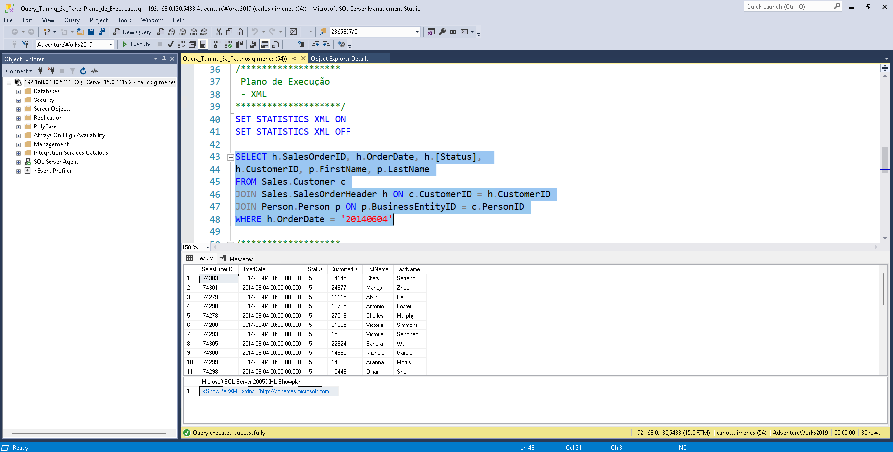

# SQL Server Expert - Query Tuning

## Plano de Execução

[Link para vídeo Plano de Execução](https://youtu.be/kE_2WSTTqoQ?si=QbHVlhyHMCCvurmM)

Veremos neste capítulo como visualizar um Plano de Execução.

Para sabermos se uma query que enviamos ao banco, executou de forma eficiente, se um índice que criei foi utilizado na execução da mesma, para isso precisamos visualizar o Plano de Execução, que nos dará estas informações.

Para nos ajudar nesta análise, temos os seguintes tipos de Plano de Execução:

- Plano de Execução do tipo Texto.
- Plano de Execução do tipo XML.
- Plano de Execução Gráfico.

Vamos à prática, para isso faremos uso da seguinte Query de Demonstração:

[Query utilizada Hands On Plano Execução](src/Query_Tuning_2a_Parte-Plano_de_Execucao.sql)

---

### Plano de Execução no modo Texto

Nosso Hands On começa mostrando o Plano de Execução em modo Texto, para isso devemos habilitar o `SET STATISTICS PROFILE ON`. Aqui cabe uma observação importante para o comando `SET`, ele é utilizado para configurar a seção e não altera o padrão do servidor ou comportamento das demais conexões.

Ao habilitarmos o `SET STATISTICS PROFILE ON` e rodarmos a query, além de nos dar o resultado da consulta, também teremos um segundo grid com Plano de Execução em modo texto. Um exemplo deste resultado pode ser visto na figura abaixo:


No destaque, a identação mais a direita, nos mostra a fase que ocorreu primeiro, sendo que as que estão mais a esquerda, foram feitas posteriormente.

Outro comando importante é o `SET STATISTICS IO ON` que nos dá uma informação importante para o Tuning de Query, que é o volume total de `IO` que a Query consumiu. Ao habilitarmos e processarmos novamente nossa Query, iremos observar que uma nova guia irá aparecer, chamada de `Messages`, ela nos dá o total de `IO` por tabela. A informação mais importante que temos aqui é o `logical reads xx` que nos dá o total de leitura de páginas de 8 Kb lidas. Um exemplo deste resultado pode ser visto na figura abaixo:


Para este exemplo, podemos identificar o Total de `IO` fazendo o seguinte:

```txt
Table 'Person'. Scan count 0, logical reads 97
Table 'Customer'. Scan count 0, logical reads 68
Table 'SalesOrderHeader'. Scan count 1, logical reads 686
```

```text
Total de IO = 97 (logical reads Table Person) + 68 (logical reads Table Customer) + 686 (logical reads Table SalesOrderHeader) = 854 páginas de 8 kb

Em termos de volume de dados = 854 páginas de 8 kb x 8kb = 6.832 kb / 1024 = 6.67 mb
```

Um dos principais objetivos de fazermos este trabalho de Tuning de Query é reduzir este volume de `IO`, reduzindo este volume eu consigo diminuir a carga de trabalho no servidor, permitindo que ele execute mais queries e aumentando o throughput.

Outro comando que nos ajuda neste trabalho de Tuning, porém é menos utilizado é o `SET STATISTICS TIME ON`, que nos mostra o tempo de execução do Plano de Execução, além do tempo de Compilação, porém no dia a dia fica um pouco complicado sua utilização, pois temos diversas variáveis que entram nesta conta. Um exemplo deste resultado pode ser visto na figura abaixo:


---

### Plano de Execução no modo XML

Outro modo de vermos o Plano de Execução é o XML, para isso devemos habilitar o `SET STATISTICS XML ON`.

Ao habilitarmos o `SET STATISTICS XML ON` e rodarmos a query, além do resultado da consulta, também teremos um segundo grid com Plano de Execução em modo xml. Um exemplo deste resultado pode ser visto na figura abaixo:



Para visualizarmos o resultado em modo gráfico, basta clicar no resultado para que uma nova aba seja aberta e o resultado possa ser analisado. Porém, podemos visualizar o plano gráfico, sem utilizar o `SET STATISTICS XML ON`. Para isso devemos ir até o menu `Query` e clicar em `Include Actual Execution Plan` (deixa habilitado apenas para a janela de query que realizamos o procedimento). Agora ao executarmos nossa query, iremos observar que uma terceira aba com o `Execution plan` será disponibilizada. Um exemplo deste resultado pode ser visto na figura abaixo:


E como interpretamos o Plano de Execução em modo Gráfico? Fazemos a leitura da direita para a esquerda, se dois pares estão na mesma posição, de cima para baixo. Um exemplo desta sequência de leitura pode ser visto na figura abaixo:


Neste exemplo, as etapas foram resolvidas da seguinte forma: primeiro ocorreu um Clustered Index Scan (1), em seguida um Clustered Index Seek (2), depois um Nested Loops (3), depois um Clustered Index Seek (4), depois um Nested Loops (5) e por último um Select (6).

Observe que a grossura da seta tem representatividade, quanto mais grossa, mas linhas serão retornadas, quanto mais fina, menos linhas de retorno.

Ao pararmos o mouse sobre a fase, será mostrado as estatísticas completas daquela fase. Aqui um ponto importante de observação é para o `Actual ...` e ao `Estimated ...`, onde tudo que estiver como `Estimated ...` foi uma estimativa antes de rodar e apenas olhando a estatít